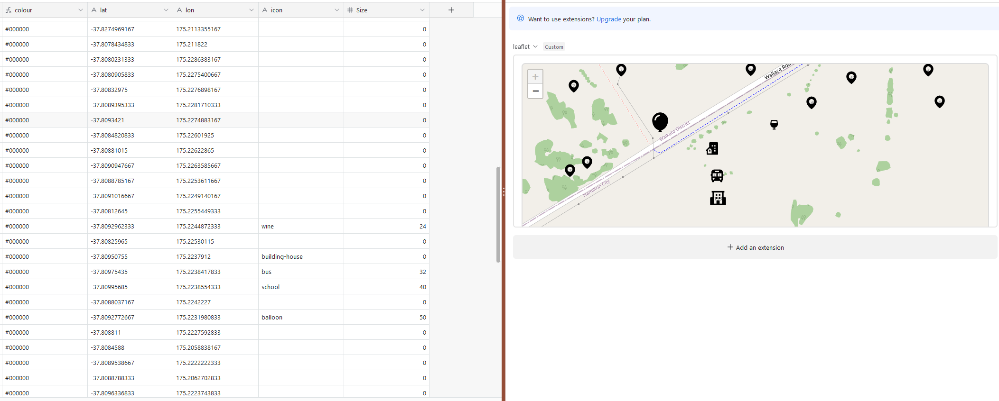
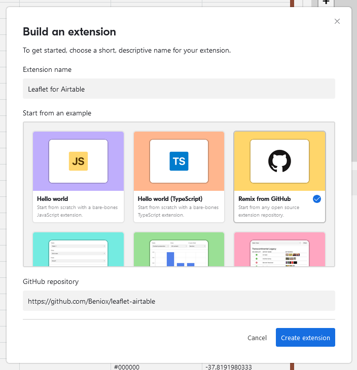

# Leaflet Map Integration with Airtable

This project integrates Airtable with Leaflet.js using OpenStreetMap to create interactive, customizable maps.



# Features
- Displays an interactive map using Leaflet.js.
- Fetches data from Airtable, including:
  - Latitude and longitude coordinates.
  - Name, color, icon type, and icon size.
- Customizable marker descriptions shown on click.
- Settings panel for seamless configuration within the Airtable block interface.


## Table of Content
- [Technologies Used](#technologies-used)
- [Configuration](#configuration)
  - [Database](#database)
    - [Table](#table)
    - [Latitude Field](#latitude-field)
    - [Longitude Field](#longitude-field)
  - [Marker](#marker)
    - [Name](#name)
    - [Colors](#colors)
    - [Icon](#icon)
    - [Size](#size)
  - [Map Config](#map-config)
    - [Clustering](#clustering)
    - [Fullscreen](#fullscreen)
  - [Legend](#legend)
    - [Enable Legend](#enable-legend)
    - [Legend Position](#legend-position)
    - [Legend Content](#legend-content)
- [Install](#install)
  - [Requirements](#requirements)
  - [Installation Steps](#installation-steps)
- [Roadmap](#roadmap)

---

## Technologies Used
- [Leaflet.js](https://leafletjs.com/): A powerful JavaScript library for building interactive maps.
- [Airtable Blocks](https://airtable.com/developers/blocks): A platform for creating custom apps and integrations inside Airtable.
- [React](https://react.dev/): A JavaScript library for building dynamic user interfaces.
- [Boxicons](https://boxicons.com/): A versatile icon library.
- [Leaflet.Fullscreen](https://github.com/Leaflet/Leaflet.fullscreen): A plugin to enable fullscreen functionality for Leaflet maps.
- [Leaflet.markercluster](https://github.com/Leaflet/Leaflet.markercluster): Provides animated marker clustering functionality for Leaflet
- [Leaflet.GestureHandling](https://github.com/elmarquis/Leaflet.GestureHandling): A plugin to enable gesture handling for Leaflet maps.

---

# Configuration

## Database
### Table
Select the Airtable table to be used with the map.

### Latitude Field
Choose a numeric field with at least four decimal points for latitude values.

### Longitude Field
Choose a numeric field with at least four decimal points for longitude values.

*If the latitude or longitude field value is out of range or empty, the corresponding marker will not be displayed.*

## Marker
### Name
Define the name of the marker, which must be set from a field in the Airtable table. This name will be used in popups or labels to provide context.
### Colors
You can configure marker colors in two ways:
#### Static Colors
All markers will share the same color. Click the color field in the settings panel to open a color picker.

#### Dynamic Colors
Markers can have dynamic colors based on Airtable table data:
- Single Line Text: Use valid CSS color names (e.g., `red`, `blue`), hex codes (e.g., `#00ff00` for green) or color objects (`rgba(r,g,b,a)` to have an alpha valve). See [MDN colors](https://developer.mozilla.org/en-US/docs/Web/CSS/color_value) for usable colors
- Single Select: Enable color-code options in the formatting section of your Airtable table and select a color.

### Icon
Set the icon type for the markers. Icons can be configured either statically or dynamically, similar to colors:

- **Static Icons**: Select a specific icon to apply to all markers.
- **Dynamic Icons**: Assign icons based on an Airtable table field. Valid icons include any from [Boxicons](https://boxicons.com/).

If the icon field is empty or contains an invalid value, a default marker icon will be used.

### Size

Marker size can be configured either statically or dynamically:

This allows you to customize the map markers based on your data attributes:

- **Static Size**: Set a uniform size for all markers.
- **Dynamic Size**: Define marker size based on an Airtable table field.

If the size is set to `0`, the marker will not be displayed. If the field value is missing or invalid, the marker size will default to `32`.


## Map config
### Clustering
Enable or disable marker clustering. When enabled, nearby markers are grouped together to improve map readability, especially at lower zoom levels.

### Fullscreen

Toggle fullscreen functionality for the map. This option allows users to expand the map to fill the entire screen, enhancing usability for detailed exploration.

### Gesture Handling
Toggle gesture handling for the map. When enabled, the map will respond to touch gestures on mobile devices, such as pinch-to-zoom and swipe-to-pan.
On desktop devices, the map will respond to ctrl + scroll events for zooming.

## Legend
The legend displays the marker name, color, and icon for each marker on the map. It can be toggled on or off using the settings panel.

### Enable Legend
Toggle the legend on or off.

### Legend Position
Choose the position of the legend on the map: `top-left`, `top-right`, `bottom-left`, or `bottom-right`.

### Legend Content

Define each legend item with a name, color, and icon.

---

# Install



## Requirements
- [Node.js](https://nodejs.org/en/download): Ensure it is installed on your system.
- [git](https://git-scm.com/): Required for cloning and updating the extension.


## Installation Steps
1. Click `Add an extension` in your Airtable base.
2. Select `Build a custom extension`
3. Under the `Start from an example section`, click `Remix from GitHub'in the 'Start from an example`
4. Paste `https://github.com/Beniox/leaflet-airtable` as the GitHub repository
5. Click `Create Extension`
6. Install the CLI: `npm install -g @airtable/blocks-cli`
7. Open a terminal in your desired folder and run the command provided by Airtable, starting with `block init ...`
8. Create an [API token](https://airtable.com/create/tokens) with the following scope: `scope:manage, Access:name` of your base
9. Navigate to the created folder using the terminal and run: `block release`
10. The extension should now be available in your Airtable base. If errors occur, ensure the API token and configuration are correct.

[//]: # (## Update)

[//]: # ()
[//]: # (To update the extension, open a terminal in the folder and run:)

[//]: # (```npm)
[//]: # (npm run update)

[//]: # ()
[//]: # (```)

[//]: # (This will fetch the latest version from the repository, override your local version, and upload it to your Airtable base.)


# Roadmap
- [ ] printing the map