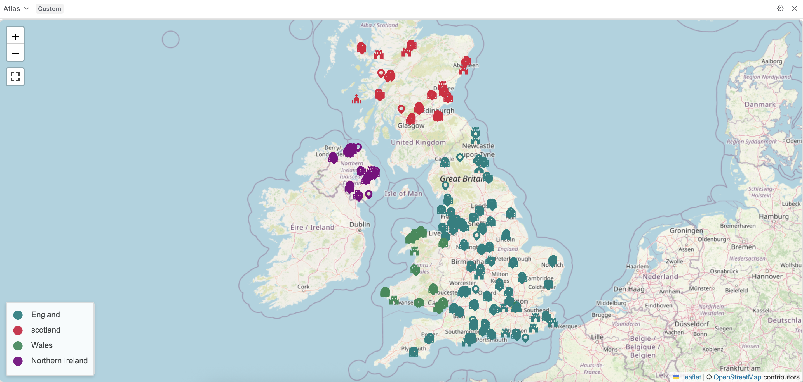
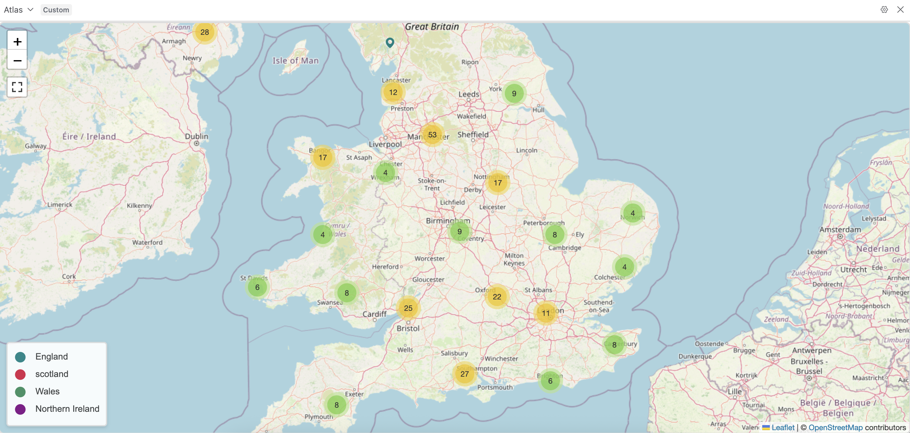

<p align="center">
  <a href="https://github.com/Beniox/Atlas">
    
  </a>
</p>

<h1 align="center">Atlas – Interactive Airtable Maps with Leaflet</h1>
<p align="center">Turn any Airtable table with latitude/longitude fields into a beautiful, interactive map — no code.</p>

---





## What you can do

- See your records on an OpenStreetMap-powered map (via Leaflet)
- Click markers to open popups with details
- Style markers by **color**, **icon**, and **size** (static or from fields)
- Turn **clustering** on/off for large datasets
- Show/hide a **legend** (drag-and-drop order)
- Go **fullscreen** and use friendly gesture controls

---


##  Configure the map (in the extension settings)

**Database**

- **Table:** choose the table with your locations.
- **Latitude field:** numeric field (ideally 4+ decimals).
- **Longitude field:** numeric field (ideally 4+ decimals).

**Marker**

- **Name:** pick a field (used in popups/labels).
- **Color:**
    - *Static:* choose one color for all markers.
    - *Dynamic:* drive color from a field. Works with:
        - Single line text: any valid CSS color (`red`, `#00ff00`, `rgba(0,0,0,0.5)`)
        - Single select: use the option’s color (enable color in Airtable formatting)
- **Icon:**
    - *Static:* pick one icon for all markers.
    - *Dynamic:* pick a field with icon names from [Boxicons](https://v2.boxicons.com/). Currently only the solid variants are supported.
- **Size:**
    - *Static:* one size for all.
    - *Dynamic:* pick a numeric field. 0 hides the marker; empty/invalid defaults to 32.

**Map config**

- **Clustering:** group nearby markers to declutter.
- **Fullscreen:** toggle fullscreen mode.
- **Gesture handling:** friendly scroll/zoom (desktop: Ctrl+scroll; mobile: pinch/drag).
- **Map start position:** 
  - *Fit to data (default):* Automatically centers and zooms the map to include all records with valid **Latitude** and **Longitude**.
  - *Custom center + zoom:* Enter a **Latitude**, **Longitude**, and **Zoom** to use every time the map loads (handy for demos or when a view starts empty).

**Legend**

- **Enable legend**: show/hide
- **Position**: top-left • top-right • bottom-left • bottom-right
- **Content**: define items with name, color, and icon; drag to reorder

---


## Example data

If you’re testing, add a few rows to your table like:

| Name     | Latitude | Longitude | Color            | Icon | Size |
| -------- | -------- | --------- | ---------------- | ---- | ---- |
| Cafe A   | 52.5200  | 13.4050   | teal             | coffee | 28   |
| Museum B | 48.8566  | 2.3522    | #ff6600          | bank | 34   |
| Park C   | 51.5074  | -0.1278   | rgba(0,128,0,.8) | tree | 32   |


A CSV file with example data can be found [here](./examples/uk_locations.csv)

---

## Troubleshooting

- **No markers appear**
    - Ensure lat/long fields are numeric and within valid ranges
    - Check you selected the correct table/fields in the sidebar
    - Check that you have the correct icon name
- **Performance feels slow**
    - Turn on **Clustering**

---

## Privacy & data

- Your data stays in **Airtable**; there’s **no external server**.
- Map tiles are fetched from **OpenStreetMap** (via Leaflet).
- Icons are fetched from **Boxicons**.
- No analytics or tracking are built in.

---

##  Feedback, bugs & feature requests

We track everything in **GitHub Issues**:

- **Report a bug:** [Open a bug report](../../issues/new?template=bug_report.md)
- **Request a feature:** [Suggest a feature](../../issues/new?template=feature_request.md)
- **Ask a question / support:** [Start here](../../issues/new?template=help-request.md)

> Please include screenshots and clear steps to reproduce when reporting bugs.


##  Tech stack

- **Leaflet.js** (map)
- **Airtable Extensions** (UI, data)
- **React** (component framework)
- Plugins: Leaflet.Fullscreen • Leaflet.markercluster • Leaflet.GestureHandling • Boxicons

---

## Roadmap (short)

- more Cluster Marker [Options](https://github.com/Leaflet/Leaflet.markercluster?tab=readme-ov-file#other-options) 

*Have an idea?* Open a **feature request**!

---

# Install


## Requirements
- [Node.js](https://nodejs.org/en/download): Ensure it is installed on your system.
- [git](https://git-scm.com/): Required for cloning and updating the extension.


## Installation Steps
1. Click `Add an extension` in your Airtable base.
2. Select `Build a custom extension`
3. Under the `Start from an example section`, click `Remix from GitHub'in the 'Start from an example`
4. Paste `https://github.com/Beniox/atlas` as the GitHub repository
5. Click `Create Extension`
6. Install the CLI: `npm install -g @airtable/blocks-cli`
7. Open a terminal in your desired folder and run the command provided by Airtable, starting with `block init ...`
8. Create an [API token](https://airtable.com/create/tokens) with the following scope: `scope:manage, Access:name` of your base
9. Navigate to the created folder using the terminal and run: `block release`
10. The extension should now be available in your Airtable base. If errors occur, ensure the API token and configuration are correct.

[//]: # (## Update)

[//]: # ()
[//]: # (To update the extension, open a terminal in the folder and run:)

[//]: # (```npm)
[//]: # (npm run update)

[//]: # ()
[//]: # (```)

[//]: # (This will fetch the latest version from the repository, override your local version, and upload it to your Airtable base.)