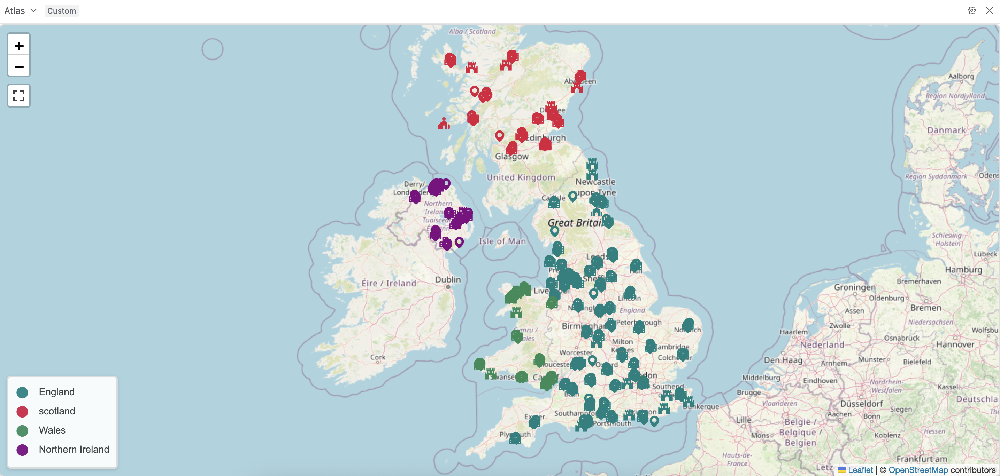
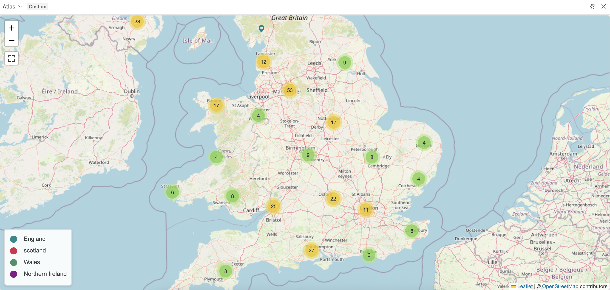
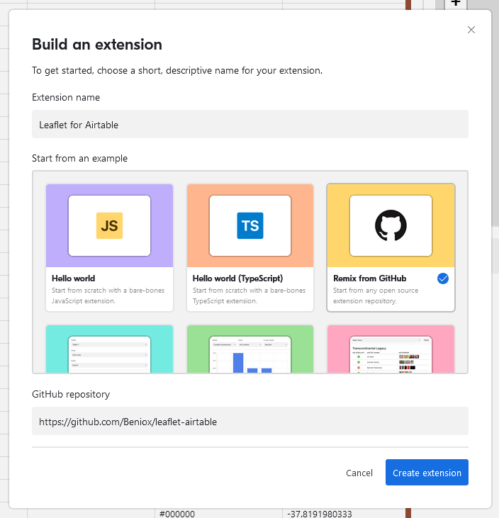

  

<h1 align="center">Atlas – Interactive Airtable Maps with Leaflet</h1>

Turn any Airtable table with latitude/longitude fields into an interactive map, right inside your base.

---

## Features

- Shows your records as markers on an OpenStreetMap map (via Leaflet)
- Click a marker to open a popup with the record name
- Marker color, icon and size can be fixed or driven by fields in your table
- The full [Boxicons](https://v2.boxicons.com/) icon set, with a searchable picker built in
- Optional clustering for large datasets
- Configurable legend with drag-and-drop ordering and a live preview
- Fullscreen mode and gesture handling (Ctrl + scroll to zoom)
- Warns about records it can't place, such as missing or out-of-range coordinates
- Your data never leaves Airtable; map tiles come from OpenStreetMap

## Getting started

The first time you open the extension, a short setup wizard walks you through the required choices: the table, the latitude/longitude fields, and the field used for popup titles. If your fields are named something like "Latitude" and "Longitude", Atlas finds them on its own and you only have to confirm.

Markers start out with a simple style (one icon, one color for everything), so the map works right away. Everything can be changed later through the settings button in the top right corner.

## Settings

Every setting has a small help icon in the settings panel that explains what it does. The main options:

**Database** – the table and the two number fields with coordinates. Latitude must be between -90 and 90, longitude between -180 and 180. Four or more decimal places are recommended.

**Marker**

- *Name:* the field shown in the popup.
- *Color:* one fixed color, or per record from a field. Single select fields use the option's color; text and formula fields accept any CSS color (`red`, `#00ff00`, `rgba(0,0,0,0.5)`).
- *Icon:* one fixed icon, or per record from a text field with Boxicons names. Bare names like `map` work (the solid variant is preferred), as do prefixed ones like `bx-home`, `bxs-star` or `bxl-github`. The "Browse icons" button opens a searchable picker so you don't have to guess names.
- *Size:* one fixed size, or per record from a number field. `0` hides a marker; empty or invalid values fall back to 32.

**Map**

- Clustering, fullscreen and gesture handling toggles.
- Start position: fit to your data (default), or a fixed center and zoom level.
- Invalid marker warnings: a small box on the map lists records that can't be shown, and records whose icon name doesn't exist. Can be turned off.

**Legend** – an optional box on the map that explains your colors and icons. Add entries, pick their icons from the same icon browser, drag to reorder, and check the result in the live preview.

If you want to start over, there is a "Reset all settings" button at the bottom of the settings.

## Example data

| Name     | Latitude | Longitude | Color            | Icon   | Size |
| -------- | -------- | --------- | ---------------- | ------ | ---- |
| Cafe A   | 52.5200  | 13.4050   | teal             | coffee | 28   |
| Museum B | 48.8566  | 2.3522    | #ff6600          | bank   | 34   |
| Park C   | 51.5074  | -0.1278   | rgba(0,128,0,.8) | tree   | 32   |

A CSV with example data is in [examples/uk_locations.csv](./examples/uk_locations.csv).

## Troubleshooting

- **No markers appear.** Check the warning box in the top right corner of the map. It lists the records that could not be placed and why – usually the coordinates are missing, swapped, or not numeric.
- **Markers show the default pin instead of my icon.** The icon name doesn't exist in Boxicons. The warning box names the affected records; use the icon picker in the settings to find valid names.
- **The map feels slow.** Turn on clustering.

## Privacy

- Your data stays in Airtable; there is no external server.
- Map tiles are fetched from OpenStreetMap.
- The icon font is fetched from the Boxicons CDN (unpkg).
- No analytics or tracking.

## Feedback, bugs and feature requests

Everything is tracked in GitHub Issues:

- [Report a bug](../../issues/new?template=bug_report.md)
- [Request a feature](../../issues/new?template=feature_request.md)
- [Ask a question](../../issues/new?template=help-request.md)

Screenshots and steps to reproduce help a lot.

## Installation

You need [Node.js](https://nodejs.org/en/download) and [git](https://git-scm.com/).

1. Click "Add an extension" in your Airtable base.
2. Select "Build a custom extension".
3. Under "Start from an example", choose "Remix from GitHub".
4. Paste `https://github.com/Beniox/atlas` as the GitHub repository and create the extension.
5. Install the CLI: `npm install -g @airtable/blocks-cli`
6. Open a terminal and run the `block init ...` command that Airtable shows you.
7. Create an [API token](https://airtable.com/create/tokens) with the `block:manage` scope and access to your base.
8. Inside the created folder, run `block release`.

The extension should now be available in your base. If something fails, double-check the API token and configuration.

## Built with

Leaflet, the Airtable Blocks SDK and React, plus Leaflet.markercluster, Leaflet.Fullscreen, Leaflet.GestureHandling and Boxicons.

## License

See [LICENSE](./LICENSE).
